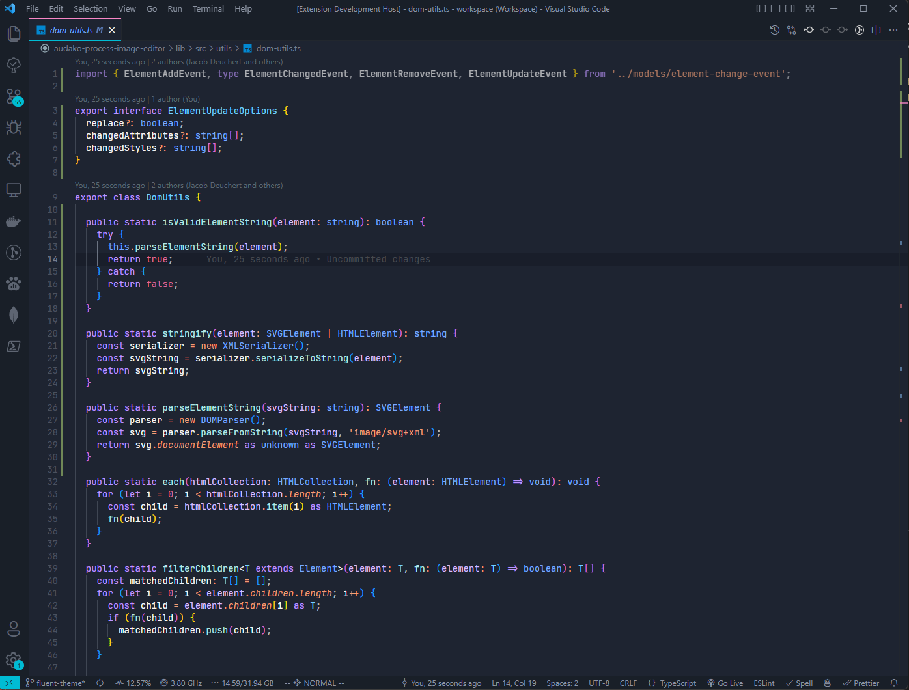
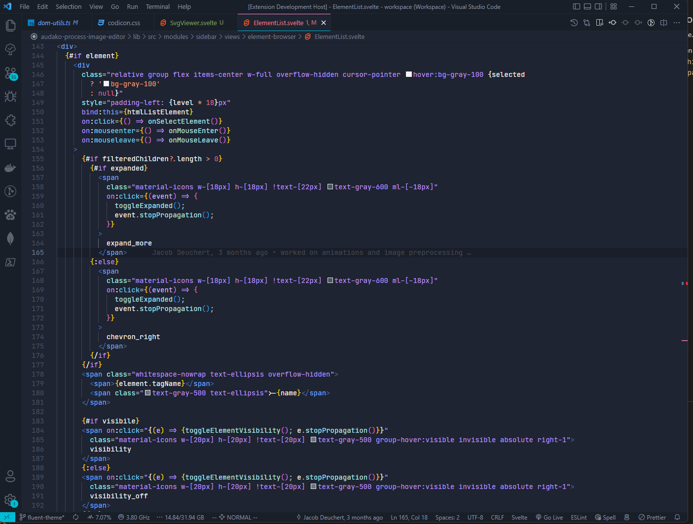
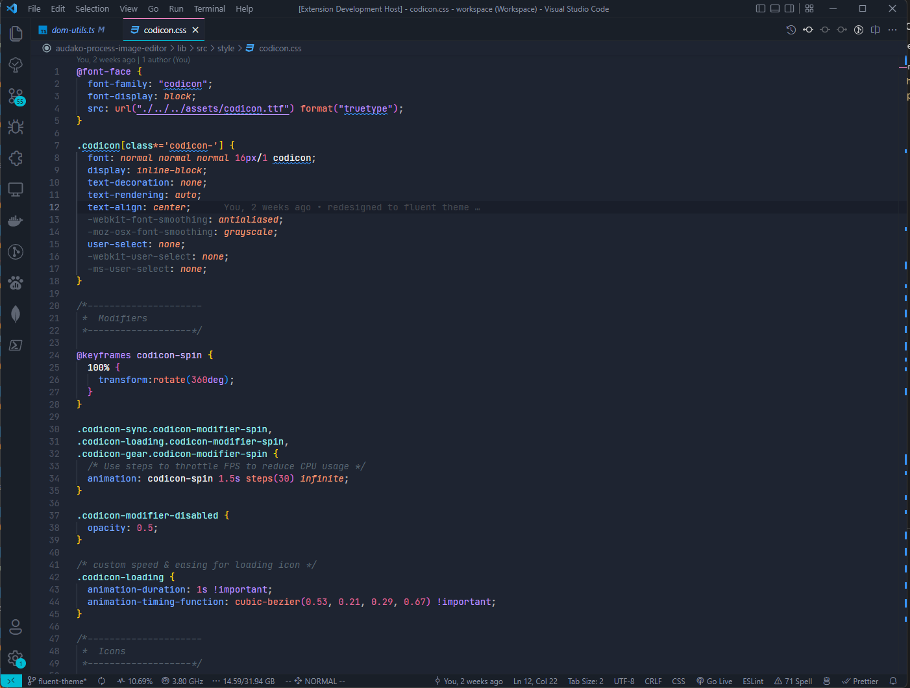

# Wintry - Theme

Minimal dark theme with blueish and purple colors.

The theme is based of the [serendipity old](https://github.com/Serendipity-Theme/old-serendipity) theme and the great color work of [Miachel Andreuzza](https://github.com/michael-andreuzza)

### Typescript

### Template

### Style 

### Feedback
If you have suggestions, please open an [issue](https://github.com/JacobDeuchert/wintry/issues).

### Authors

Authored and maintained by [Jacob Deuchert](https://github.com/JacobDeuchert)

Base theme made by [Miachel Andreuzza](https://github.com/michael-andreuzza) 